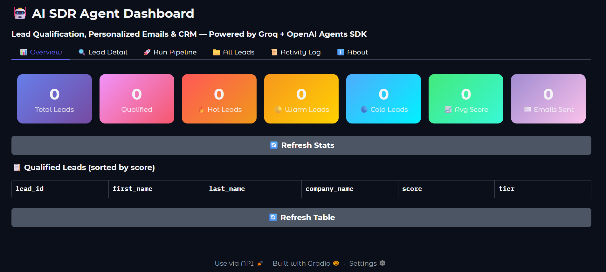
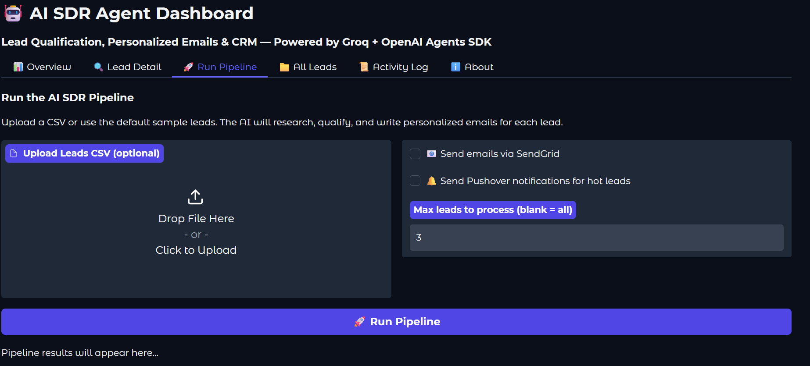
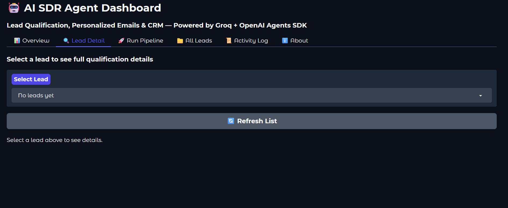
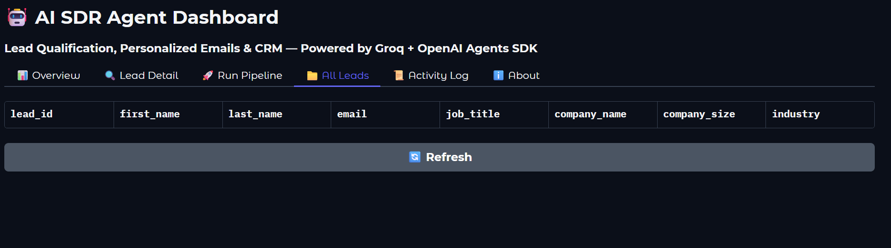
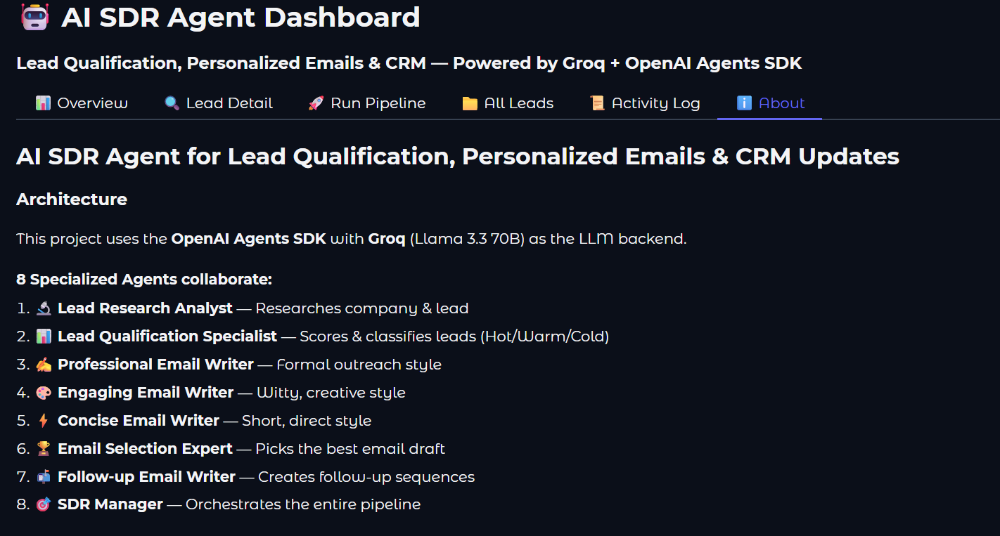

# 🤖 AI SDR Agent — Lead Qualification, Personalized Outreach & CRM Updates

> **Powered by Groq + OpenAI Agents SDK (Llama 3.3 70B)**

A production-ready **AI SDR Agent** that helps sales teams qualify leads, generate highly personalized cold emails, create follow-ups, and log everything into a lightweight CRM (SQLite) — with a clean dashboard to review results.

Built using an **agentic workflow** (multi-agent collaboration + tools) inspired by Ed Donner's Agentic AI course (Week 2 Day 2 pattern: workflow → tools → manager/orchestrator).

---

## 📸 Dashboard Preview

### Overview


### Run Pipeline


### Lead Detail


### All Leads



### About


---

## 💡 What This Solves (Client Value)

Sales teams lose time and pipeline because:
- Leads aren't qualified consistently
- Reps spend hours researching + writing similar emails
- Follow-ups get missed
- CRM notes are incomplete or outdated

This project automates that workflow while keeping **human control** over outreach.

**Typical outcomes:**
- ⚡ Faster lead qualification (minutes instead of hours)
- 🎯 More consistent messaging and follow-up quality
- 🗂️ Cleaner CRM notes and next-step recommendations
- ✉️ Higher personalization without manual research overhead

---

## ✨ Key Features

### Lead Intake
- Import leads from **CSV** (Apollo exports / form submissions / sheets)
- Standardized lead schema (name, title, company size, industry, notes)

### AI Research + Qualification
- "Company research" enrichment tool (mock enrichment now; can be upgraded to Clearbit/Apollo)
- ICP-based scoring **0–100**
- Lead tiers: **🔥 Hot / 🌤️ Warm / 🧊 Cold**
- Clear reasoning + detected buying signals

### Personalized Outreach
- Generates **3 different email drafts** (Professional / Engaging / Concise)
- Uses an AI "picker" agent to select the best draft
- Generates a **follow-up email** (3 days later angle)

### CRM + Activity Logging
- Saves qualification results, CRM note, and actions into **SQLite**
- Activity log: lead imported, qualified, email status, notes, etc.

### Dashboard
- Review leads + qualification scores
- Drill into per-lead details (score, reasoning, emails, next steps)
- Run pipeline directly from the UI (upload CSV)

### Optional Automations
- Send emails via **SendGrid** (OFF by default)
- Push notifications for hot leads via **Pushover** (optional)

---

## 🏗️ Architecture (How It Works)

**Orchestrator Agent (SDR Manager)** runs a structured pipeline:

| Step | Agent | Role |
|------|-------|------|
| 1 | 🔍 **Research Agent** | Company/lead context (enrichment tool) |
| 2 | 📊 **Qualifier Agent** | Score, tier, reasoning, buying signals, next action |
| 3 | ✍️ **Email Writers (3 styles)** | Generate alternative drafts |
| 4 | 🏆 **Picker Agent** | Selects the best email for response probability |
| 5 | 📧 **Follow-up Agent** | Writes follow-up sequence email |
| 6 | 🔧 **Tools** | Save CRM note, (optional) send email, (optional) push notification |

> This is not a chatbot — it's a practical, tool-using **agentic workflow**.

### 8 Specialized Agents

1. 🔍 **Lead Research Analyst** — Researches company & lead
2. 📊 **Lead Qualification Specialist** — Scores & classifies leads (Hot/Warm/Cold)
3. 💼 **Professional Email Writer** — Formal outreach style
4. 🎨 **Engaging Email Writer** — Witty, creative style
5. ⚡ **Concise Email Writer** — Short, direct style
6. 🏆 **Email Selection Expert** — Picks the best email draft
7. 📧 **Follow-up Email Writer** — Creates follow-up sequences
8. 🎯 **SDR Manager** — Orchestrates the entire pipeline

---

## 🛠️ Tech Stack

| Layer | Technology |
|-------|-----------|
| **LLM** | Groq — `llama-3.3-70b-versatile` (default), `llama-3.1-8b-instant` (fast tasks) |
| **Agent Framework** | OpenAI Agents SDK |
| **Backend** | Python |
| **CRM Storage** | SQLite |
| **Dashboard** | Gradio |
| **Email** | SendGrid (optional) |
| **Notifications** | Pushover (optional) |

---

## 🚀 Quick Start

### 1) Install

```bash
pip install -r requirements.txt
```

### 2) Add environment variables (do NOT commit secrets)

```bash
cp .env.example .env
# Edit .env locally with your keys
```

**Required:**
```
GROQ_API_KEY=your_key_here
```

**Optional:**
```
SENDGRID_API_KEY=your_key_here
SENDER_EMAIL=you@yourdomain.com
PUSHOVER_USER=your_user_key
PUSHOVER_TOKEN=your_app_token
```

### 3) Run the pipeline (safe mode – no email sending)

```bash
python -m src.run_pipeline --max-leads 3
```

### 4) Launch the dashboard

```bash
python dashboard/app.py
```

Open: [http://localhost:7860](http://localhost:7860)

---

## 📄 CSV Format

Your CSV must include these columns:

```
lead_id,first_name,last_name,email,job_title,company_name,company_size,industry,website,linkedin_url,lead_source,notes
```

A ready-to-run sample dataset is included:

```
data/sample_leads.csv
```

---

## ⚖️ Ethical Use & Compliance Notes

This project is designed for ethical sales automation:

- ✅ Email sending is **OFF by default** (human-in-the-loop)
- ✅ Only references fields present in the lead record (no fake personalization)
- ✅ Avoids inferring protected characteristics (race, religion, politics, health, etc.)
- ✅ Recommended: add opt-out language and comply with CAN-SPAM/GDPR applicable rules

> If you deploy this for a real business, ensure your outreach practices follow applicable laws.

---

## 🗺️ Roadmap / Upgrade Options

If you're hiring me (or using this repo as a base), I can extend it with:

- 🔗 HubSpot / Pipedrive / Salesforce integration
- 📊 Google Sheets ingestion + continuous sync
- 🔍 Real enrichment (Clearbit/Apollo/LinkedIn-based sources where permitted)
- 📅 Multi-step sequences (Day 1, Day 3, Day 7) + A/B testing
- ✅ Approval queue in dashboard ("review → approve → send")
- 👥 Team roles: SDR + manager review + audit logs
- 🐳 Deployment: Docker + Render/Fly.io + scheduled runs (cron)

---

## 💼 Want This Built For Your Business?

If you want this customized for your CRM, ICP, and outreach style, typical deliverables include:

- ICP scoring tuned to your market
- Email tone matching your brand
- CRM integration + pipeline stages
- Dashboard + reporting
- Safe sending rules and compliance guardrails

**Open an issue or contact me via Upwork** with your CRM + lead source details.
